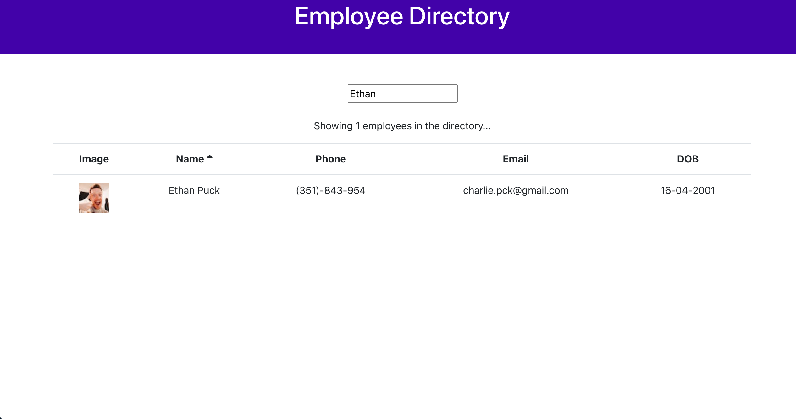

# Employee Directory

This is an application that uses React.js to create and employee directory.

## Overview
___

When the page loads, the users will be able to straight away view the entire employee directory with it's employees information which includes the following ( image, name, phone #, email, DOB ).  Also with this application the user is able to search an employee with it's corresponding information and sort the employees by ascending or descending order. 

## Heroku Link
___

## Technologies Used 
___

* React
* NodeJs
 * Bootstrap
 * Heroku
 ___
 
 
 
___
 

  
___
  

   
___
   
 

## Instructions on how to use the application
___

* Clone the repository
* Install all npm packages with `npm install`
* Run the app with `npm start`
* Enjoy the app

